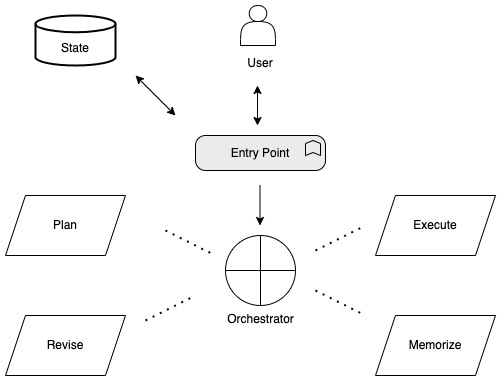

# Multi-Agent Data Analysis Assistant with LangGraph

## Overview

The purpose of this repository is to demonstrate how LangGraph can be used to build a stateless multi-agent workflow to serve as an assistant for data analysis.  This workflow leverages the [pybaseball](https://github.com/jldbc/pybaseball) Python library to extract data which is then used for analysis based on the user's request.



## Sample Usage

The sample notebooks provided demonstrate three simple use cases as examples of how this system can be used.

```
1.  How many games did the Rays win in 2022?
```

```
2.  Plot the cumulative sum of strikeouts thrown by Danny Duffy in the 2018 season.
```

```
3.  Consider the first week of August 2020 - find 3 pitchers who's curveballs were most similar to Max Scherzer's.
```

## Getting Started
1. Clone repository and navigate to the `baseball-langchain-agents` folder 
2. Update local `env` file with the required environment variables and rename to `.env`

## Running the Jupyter Notebooks
1. Within the `baseball-langchain-agents` folder in a terminal, create and activate a virtual environment
```
python3 -m venv venv
```
```
source venv/bin/activate
```
2. Install requirements
```
pip install -r requirements.txt
```
3. Navigate to the `baseball-langchain-agents` folder.
4. Open and execute the sample Jupyter Notebooks in order.  You must ensure that the Jupyter notebook is running a python kernel tied to the virtual environment you have created so that the required libraries will be available.  

The intent of the sample notebooks is to first demonstrate a use case that is unknown to the agent system, and then to demonstrate a slight variation of the same use case after the system has learned the pattern.

## Folder Structure

```
baseball-langchain-agents
│   README.md
│   .gitignore    
│   requirements.txt   
│   env  :  Template for creating local .env file  
│   *_sample_*.ipynb  :  Demonstration of a use case
│
└───images
│   │   workflow.drawio.png
│
└───agents
│   │   __init__.py
│   │   execute_agent.py : Resposible for creating the Execute Agent
│   │   orchestrate_agent.py : Resposible for creating the Orchestrate Agent
│
└───dynamodb
│   │   __init__.py
│   │   create_functions_statsapi.ipynb : Helper notebook to persist pybaseball function metadata
│   │   data_dictionary.py : String representations of the data dictionary for pybaseball functions
│   │   functions.json : Output from create_functions_statsapi.ipynb that will be read by the agent system
│
└───lambda_function
│   │   __init__.py
│   │   baseball_lambda.py : Entrypoint for the Agent system
│
└───nodes
│   │   __init__.py
│   │   execute_node.py : Responsible for creating the Execute Node
│   │   memorize_node.py : Responsible for creating the Memorize Node
│   │   plan_node.py : Responsible for creating the Plan Node
│   │   revise_node.py : Responsible for creating the Revise Node
│
└───vectordb
│   │   __init__.py
│   │   create_execution_plan_vectordb_entries.ipynb : Helper notebook to create or clear execution plans
│   │   execution_plan.csv : Execution plans are written to disk so that they can be read by vector database
│   │   vectordb.py : Helper function for creating and retrieving the vector database collection for execution plans

```